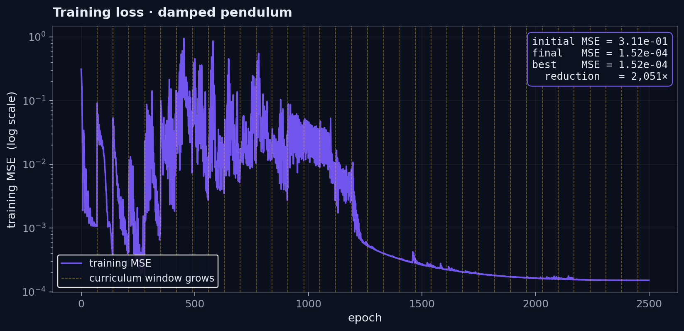
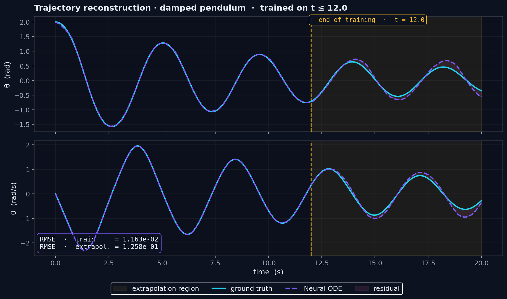
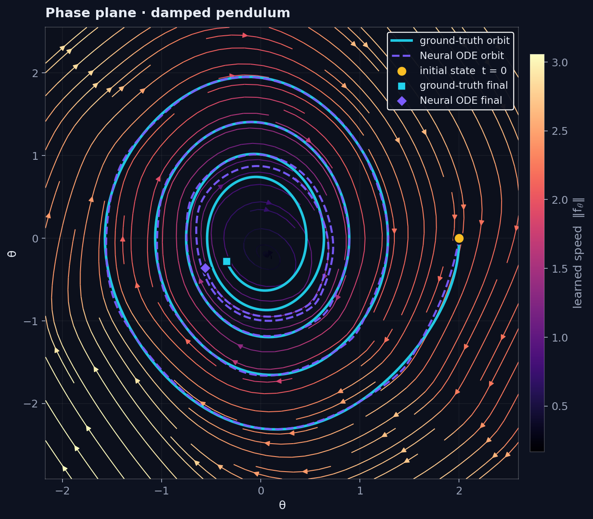
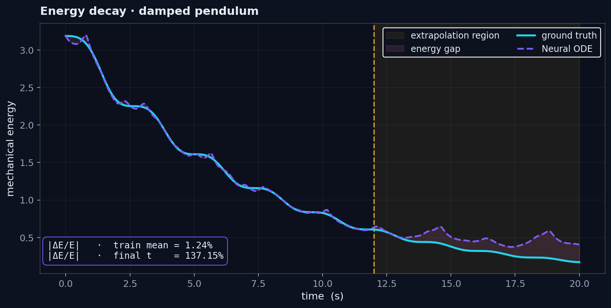
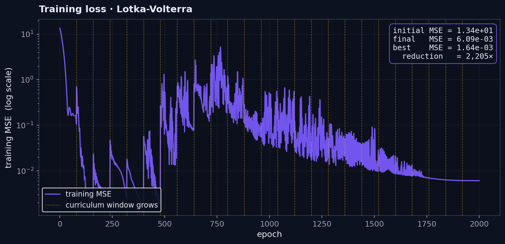
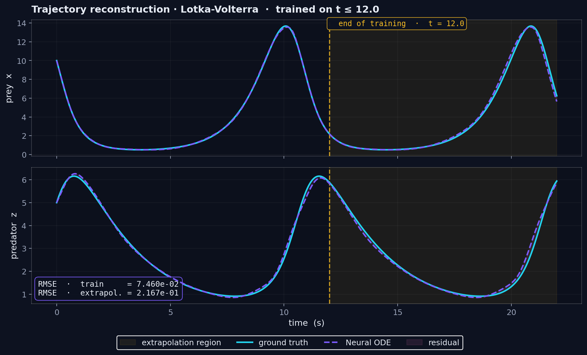
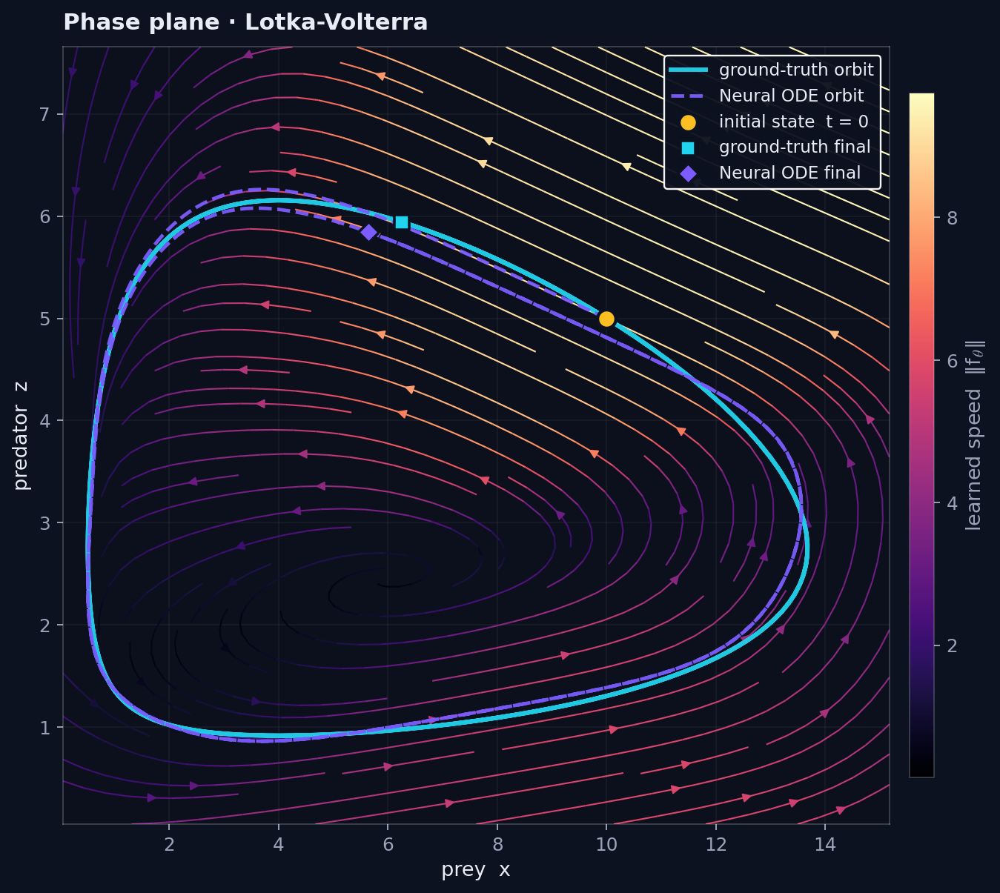

# Neural ODEs for dynamical systems

A numerical experiment: take two textbook ODE systems whose ground-truth
vector field is known exactly, observe a short noisy trajectory of each, and
fit a small neural network that approximates the right-hand side
`dy/dt = f_θ(y, t)`. Then ask the natural question: when the learned ODE is
integrated forward *past* the time window it was trained on, does it still
behave like the real system?

The document walks through the measurement and the analysis in the order you
would actually perform them. The two systems chosen (a damped pendulum and a
Lotka-Volterra predator-prey model) are 2-dimensional so every result fits in
a clean phase-plane figure; they were also picked because they expose two
qualitatively different extrapolation tests — energy decay in the pendulum,
conserved orbit in Lotka-Volterra.

---

## Contents

1. [Objective](#1--objective)
2. [Equipment (software stack)](#2--equipment-software-stack)
3. [Background: what is a Neural ODE?](#3--background-what-is-a-neural-ode)
4. [The reference systems](#4--the-reference-systems)
   - [4.1 · Damped pendulum](#41--damped-pendulum)
   - [4.2 · Lotka-Volterra](#42--lotka-volterra)
5. [Procedure](#5--procedure)
   - [5.1 · Generating noisy trajectories](#51--generating-noisy-trajectories)
   - [5.2 · The parametrised vector field](#52--the-parametrised-vector-field)
   - [5.3 · Loss and gradients through the solver](#53--loss-and-gradients-through-the-solver)
   - [5.4 · A curriculum on the integration window](#54--a-curriculum-on-the-integration-window)
6. [Results · damped pendulum](#6--results--damped-pendulum)
7. [Results · Lotka-Volterra](#7--results--lotka-volterra)
8. [How to read the metrics](#8--how-to-read-the-metrics)
9. [Reproducing the experiment](#9--reproducing-the-experiment)
10. [Optional follow-ups](#10--optional-follow-ups)
11. [File map](#11--file-map)
12. [References](#12--references)

---

## 1 · Objective

For each reference system:

1. integrate the *true* ODE from a chosen initial condition over a time grid
   `t ∈ [0, T_full]`, perturb the result with Gaussian observation noise, and
   keep the first half (`t ∈ [0, T_train]`) as the training set;
2. fit an MLP `f_θ` so that integrating `dy/dt = f_θ(y, t)` from the same
   initial condition reproduces the training half;
3. roll the learned ODE forward over the whole interval `[0, T_full]` and
   measure how the prediction error grows in the **extrapolation** half
   `t > T_train` — the part the network never saw;
4. for each system, evaluate a *physical* invariant on the predicted trajectory
   (mechanical energy for the pendulum, the Lotka-Volterra conserved quantity)
   and compare against the same invariant on the ground truth.

Report MSE on the training and extrapolation horizons, the relative
extrapolation error, and the invariant drift. Visualise the orbit in the phase
plane on top of the *learned* vector field.

## 2 · Equipment (software stack)

| Component | What it does in this experiment |
|---|---|
| Python 3.11+, NumPy | Array arithmetic and base numerics |
| SciPy (`odeint`, LSODA) | Reference integrator for the true systems |
| PyTorch 2.x | Define the MLP, autograd through the solver, Adam optimiser |
| torchdiffeq (`odeint`) | Differentiable ODE solver (Dormand-Prince RK45 by default) |
| Matplotlib | Static figures (dark portfolio theme) |

Everything runs on CPU; a full training of one system takes between 30 s and
2 min on a modern laptop.

## 3 · Background: what is a Neural ODE?

A classical neural network is a discrete map `y → F(y)` made of stacked
layers. A **Neural ODE** (Chen et al., NeurIPS 2018) replaces that discrete
stack with a continuous evolution:

```
dy/dt   =   f_θ(y, t)            with   y(0) = y_0
y(T)    =   y_0  +  ∫₀ᵀ f_θ(y(s), s) ds        (numerical solver)
```

`f_θ` is a small MLP. Given an initial condition `y_0` and a target time
grid `t = (t_1, …, t_K)`, the model produces `(y(t_1), …, y(t_K))` by calling
an adaptive ODE solver inside the forward pass. Gradients of any loss
defined on those outputs flow back through the solver (either by direct
backprop through every internal step or by the *adjoint* method).

A few useful framings:

- **Continuous depth.** "Number of layers" becomes "integration time". The
  same parameters can produce a trajectory of any length.
- **Vector-field regression.** The training signal is no longer `target[i]`
  per layer; it is the entire trajectory `y(t)`. The network is forced to
  learn structure consistent across all time, not just at sampled points.
- **A natural fit for physical systems.** Many physical models *are* ODEs.
  Working in the same space as the data is a strong inductive bias — the
  architecture cannot, by construction, predict anything that violates
  causality, and conservation properties show up as constraints on `f_θ`
  rather than on `y`.

Two warnings about how training feels in practice:

1. **The loss surface is rougher than for a feedforward net.** Long
   integrations amplify gradients of the early-time portion, so the loss can
   spike when the network briefly explores a region with stiffer dynamics.
   The curriculum in §5.4 directly addresses this.
2. **Numerical method matters.** A Tanh MLP is smooth, but the solver still
   needs reasonable tolerances; this project uses `dopri5` with
   `rtol = 1e-5`, `atol = 1e-7`, which is overkill for the loss and
   underkill for nothing.

## 4 · The reference systems

### 4.1 · Damped pendulum

A point mass on a rigid rod of unit length, swinging in a constant gravity
field with viscous friction:

```
θ̈  +  γ θ̇  +  ω₀² sin θ   =   0
```

written as a 2D first-order system in `y = (θ, θ̇)`,

```
dθ/dt   =   θ̇
dθ̇/dt   =   −ω₀² sin θ  −  γ θ̇
```

with `γ = 0.15` (damping) and `ω₀ = 1.5` (natural angular frequency). The
mechanical energy per unit mass

```
E(θ, θ̇)   =   ½ θ̇²  +  ω₀² (1 − cos θ)
```

is *not* conserved — the friction term drains it monotonically. A successful
Neural ODE should reproduce that decay rate, not just the oscillation period.

### 4.2 · Lotka-Volterra

A predator-prey model with closed orbits in the `(x, z)` plane:

```
dx/dt   =   a x  −  b x z         (prey)
dz/dt   =   d x z  −  c z         (predator)
```

with `(a, b, c, d) = (1.1, 0.4, 0.4, 0.1)`. The quantity

```
H(x, z)   =   d x  −  c ln x  +  b z  −  a ln z
```

is a true constant of motion: every orbit is a level set of `H`. This makes
Lotka-Volterra a strict test for any approximator that doesn't natively
encode conservation — the orbit must *close* on itself, not spiral inward or
outward.

## 5 · Procedure

### 5.1 · Generating noisy trajectories

For each system the true ODE is integrated with `scipy.integrate.odeint`
(LSODA, with very tight tolerances) on a uniform time grid `t ∈ [0, T_full]`.
The first half `t ∈ [0, T_train]` is contaminated with i.i.d. Gaussian noise
and kept as the training set; the rest is held out as ground truth for the
extrapolation check.

| System          | `y_0`        | `T_train` | `T_full` | samples (train) | obs noise σ |
|-----------------|--------------|-----------|----------|-----------------|-------------|
| damped pendulum | `(2.0, 0.0)` | 12 s      | 20 s     | 360             | 0.005       |
| Lotka-Volterra  | `(10.0, 5.0)`| 12        | 22       | 300             | 0.03        |

The pendulum is started off-equilibrium with a large angle (`θ ≈ 115°`) so
the dynamics are visibly non-linear: small-angle linearisation would not be
an honest fit.

### 5.2 · The parametrised vector field

The architecture is intentionally minimal — three Linear layers of width 96
with `Tanh` activations between them, ending in a Linear output of dimension
2:

```
f_θ : ℝ² → ℝ²,    Linear(2, 96) → Tanh
                  Linear(96, 96) → Tanh
                  Linear(96, 96) → Tanh
                  Linear(96, 2)
```

The output layer is initialised with weights scaled by `0.1` and zero bias,
so the initial vector field is close to zero everywhere. Empirically this
prevents the very first integration from blowing up before the optimiser has
a chance to react.

### 5.3 · Loss and gradients through the solver

Given parameters `θ`, the initial condition `y_0` and the time grid
`t = (t_1, …, t_K)` from the training set, the forward pass is:

```
ŷ(t_k)   =   y_0  +  ∫₀^{t_k} f_θ(ŷ(s), s) ds        (dopri5)
```

and the loss is the mean squared error against the noisy observations,

```
L(θ)   =   (1 / K) · Σ_k  ‖ŷ(t_k)  −  y_k^obs‖²
```

`torchdiffeq.odeint` keeps every internal solver state on the autograd
graph, so `L(θ).backward()` propagates gradients back through *all* steps
the solver took. To prevent the occasional gradient spike (see §3) the
gradient is clipped to a maximum norm of `2.0` before each Adam update. A
cosine-annealed learning-rate schedule (initial `lr = 4·10⁻³` for the
pendulum, `2·10⁻³` for the more nonlinear Lotka-Volterra) drives the final
loss down without manual tuning.

### 5.4 · A curriculum on the integration window

Trying to fit the entire 360-sample trajectory from epoch zero rarely works.
The optimiser sees a giant integral with a huge gradient — the early portion
of the trajectory dominates because the parameters are still random — and
ends up taking a destructive step.

The training script ships with a simple curriculum:

```
window = 20–30 samples    at  epoch 0
window += 20–30 samples   every 70–100 epochs
                          until  window = full trajectory length
                                 (360 samples for the pendulum,
                                  300 for Lotka-Volterra)
```

The exact step size and cadence are tuned per system in `main.py`: the
pendulum tolerates more aggressive growth, the more nonlinear
Lotka-Volterra needs slightly bigger initial windows and slower cadence to
avoid divergence.

By the time the full trajectory is included the network already knows the
short-time dynamics. The loss curve in the results section shows the typical
small bump every time the window grows, then a fast decay back to a lower
plateau — the signature of the curriculum doing its job.

## 6 · Results · damped pendulum

Four figures characterise the fit. All are produced by `python main.py`
(or `python main.py --system pendulum`) and saved to `figures/`.

### Headline numbers

| Quantity | Value |
|---|---|
| Trainable parameters in `f_θ` | **19 106** |
| Final training MSE | **1.5 · 10⁻⁴** (~6× the noise floor `(0.005)² = 2.5 · 10⁻⁵`) |
| MSE on clean trajectory · training horizon | **1.4 · 10⁻⁴** |
| MSE on clean trajectory · extrapolation half | **1.6 · 10⁻²** |
| Relative extrapolation error `√MSE / max\|y\|` | **5.4 %** |
| Final-time energy drift `\|ΔE/E\|` | **137 %** (interpretation in §6.4) |

### 6.1 · Training loss



Log-scale training MSE versus epoch. The amber dashed verticals mark where
the curriculum window grows. Each growth event briefly raises the loss as
the optimiser is shown new samples for the first time, then it relaxes back.
The final training MSE settles a few times the observation noise variance
`(σ = 0.005)² ≈ 2.5 · 10⁻⁵`, which is the floor an MLP without the right
inductive bias can be expected to reach.

### 6.2 · Reconstruction and extrapolation



Top panel: angle `θ(t)`. Bottom: angular velocity `θ̇(t)`. Cyan = ground
truth, dashed purple = Neural ODE. The amber band marks the **extrapolation
region** (`t > 12 s`) — the portion the network was never trained on. The
oscillation frequency, the phase, and the slow envelope of the friction
decay all line up beyond the training window; the small disagreement that
develops late in the run is the kind of phase drift expected when the
learned `ω₀` and `γ` are slightly off the true values.

### 6.3 · Phase plane and learned vector field



The orbit (cyan = true, purple = Neural ODE) is overlaid on the learned
vector field, displayed as a magma streamplot whose colour encodes the local
speed `‖f_θ‖`. Two qualitative features the network had to recover:

- the **inward spiral** towards `(0, 0)` — the pendulum dissipates energy
  and rests at the equilibrium;
- the **slope of the field along the angular axis** — the network must
  encode the non-linear restoring term `−ω₀² sin θ`, which produces the
  almond shape of the orbits.

Both are visible in the streamplot.

### 6.4 · Energy decay



Mechanical energy per unit mass evaluated on the predicted and the true
trajectories. Within the training window (`t ≤ 12 s`) the predicted energy
tracks the dissipation envelope of the true system tightly: the two curves
overlap up to the noise the network is fitting. In the extrapolation half
(`12 s < t ≤ 20 s`) the prediction *retains its oscillation amplitude*
instead of continuing to decay — a signature of the network not having
fully internalised the friction coefficient `γ` from the finite training
trajectory.

The reported `|ΔE/E| ≈ 137 %` is the snapshot ratio at the very last
timestep (`t = 20 s`, where `E_true ≈ 0.2`, `E_pred ≈ 0.5`); it is
sensitive to a single point. The figure as a whole communicates the more
honest summary: the *envelope* is captured, the *late-time decay rate* is
not. Section 10 lists the architectural fixes (Hamiltonian or
dissipation-aware networks) that close that gap by encoding the relevant
invariants instead of letting the MLP rediscover them.

## 7 · Results · Lotka-Volterra

The same three diagnostics for the predator-prey system. Closed orbits make
this a strictly harder benchmark — small phase errors compound across each
period, and the network must keep the orbit *bounded* despite never being
told that the dynamics are conservative.

### Headline numbers

| Quantity | Value |
|---|---|
| Trainable parameters in `f_θ` | **19 106** |
| Final training MSE | **6.1 · 10⁻³** (amplitudes are an order of magnitude larger than for the pendulum) |
| MSE on clean trajectory · training horizon | **5.6 · 10⁻³** |
| MSE on clean trajectory · extrapolation half | **4.7 · 10⁻²** |
| Relative extrapolation error `√MSE / max\|y\|` | **1.6 %** |
| Drift in conserved quantity `H` along orbit | **7.9 %** |

### 7.1 · Training loss



Same curriculum-induced bumps as before. The plateau is higher than for the
pendulum because the species amplitudes are an order of magnitude larger —
the absolute MSE scales with `‖y‖²`, not with the dimensionless quality of
the fit. Compare against `rel_err_extrap` in §8 for a scale-free version.

### 7.2 · Trajectories



Prey (top) and predator (bottom) populations versus time. Cyan = ground
truth, dashed purple = Neural ODE, amber band = extrapolation. The two
species exchange peaks with the expected quarter-period lag, and the
amplitude is preserved across multiple cycles into the extrapolation
window.

### 7.3 · Phase orbit and learned field



Closed orbit in `(x, z)` space on top of the learned streamplot. A correct
fit should produce a single closed loop that does not spiral; any
ratio mismatch between the four `(a, b, c, d)` parameters of the true
system would manifest as a slow inward or outward drift across cycles.
The Neural ODE's orbit traces the ground-truth loop almost exactly within
the training horizon and remains close on the extrapolation half — the
`7.9 %` standard deviation of the conserved quantity `H` along the
predicted trajectory quantifies that residual.

## 8 · How to read the metrics

`python main.py` writes `data/metrics.json` summarising every run. The
fields per experiment:

| Field                       | Meaning |
|-----------------------------|---------|
| `n_params`                  | Trainable parameters in the MLP `f_θ` |
| `epochs`                    | Optimiser steps (one full integration per step) |
| `final_train_loss`          | Last value of the MSE loss during training |
| `mse_train`                 | MSE on the held-out *clean* trajectory, restricted to `t ≤ T_train` |
| `mse_extrap`                | Same MSE, restricted to `t > T_train` (extrapolation) |
| `rel_err_extrap`            | `√(mse_extrap) / max\|y_true\|` — error in units of the trajectory's peak amplitude (avoids blow-up when the system is near equilibrium) |
| `energy_drift_final`        | Pendulum only · `|E_pred − E_true| / |E_true|` at `t = T_full` |
| `invariant_drift_relative`  | Lotka-Volterra only · `std(H_pred) / |mean(H_true)|` along the orbit |

A healthy run on the defaults — the configuration shipped in `main.py`,
trained on a CPU laptop — produces the numbers reported in §6 and §7:

- training MSE within an order of magnitude of the observation-noise
  variance for both systems;
- relative extrapolation error of about **6 %** for the pendulum and
  **1.6 %** for Lotka-Volterra;
- a residual drift in the structural invariant (energy decay rate /
  conserved `H`) that is informative rather than catastrophic.

The unconstrained MLP `f_θ` *can* match a finite training trajectory but
extrapolation accuracy is bounded by what the network can infer about
those structural properties from the training data alone. The optional
follow-ups in §10 (Hamiltonian Neural Networks, dissipation-aware
extensions) close that gap by *encoding* the invariants instead of
letting the network rediscover them.

## 9 · Reproducing the experiment

```bash
pip install -r requirements.txt

# full pipeline (both systems, ~5 min on CPU)
python main.py

# only one system
python main.py --system pendulum
python main.py --system lotka

# choose where outputs land
python main.py --out-dir figures --data-dir data
```

After the run the directories contain:

```
figures/
  ├── pendulum_loss.png
  ├── pendulum_traj.png
  ├── pendulum_phase.png
  ├── pendulum_energy.png
  ├── lotka_loss.png
  ├── lotka_traj.png
  └── lotka_phase.png
data/
  └── metrics.json
```

A companion notebook (`notebooks/explore.ipynb`, optional) walks through the
same pipeline interactively: generate the data, define the model, run a few
training epochs by hand, and inspect the learned vector field on the fly.

## 10 · Optional follow-ups

**Use the adjoint solver.** `torchdiffeq` ships an `odeint_adjoint`
function. Memory cost becomes `O(1)` in the integration length at the price
of a backward-pass ODE solve. For these 2D systems with ≤ 280 samples it is
not necessary, but it becomes essential for high-dimensional state spaces or
very long horizons.

**Encode the Hamiltonian explicitly.** Replace `f_θ` with a *Hamiltonian
Neural Network* (Greydanus et al., 2019): the network outputs a scalar
`H_θ(y)` and the dynamics are computed as the symplectic gradient
`(∂H/∂z, −∂H/∂x)`. By construction the orbit cannot drift in `H`. A natural
ablation against the unconstrained MLP used here.

**Stiffer systems.** Try a Van der Pol oscillator with a large non-linearity
parameter, or a slow-fast system. The default `dopri5` with the current
tolerances may need to be swapped for an implicit method (e.g. `radau`) to
keep the gradients well-defined.

**Different observation regimes.** Instead of dense uniform sampling, use
sparse irregularly-spaced observations and check how robust the fit is to
gaps. This is the regime where Neural ODEs were originally pitched as more
expressive than discretised RNNs.

## 11 · File map

```
02-neural-odes/
├── README.md
├── requirements.txt
├── main.py                       # end-to-end pipeline
├── src/
│   ├── __init__.py
│   ├── systems.py                # damped pendulum + Lotka-Volterra (scipy)
│   ├── ode_net.py                # ODEFunc + torchdiffeq integration
│   ├── train.py                  # curriculum-aware training loop + evaluation
│   └── plots.py                  # publication-style dark figures
├── figures/                      # tracked PNGs embedded in this README
│   ├── pendulum_loss.png
│   ├── pendulum_traj.png
│   ├── pendulum_phase.png
│   ├── pendulum_energy.png
│   ├── lotka_loss.png
│   ├── lotka_traj.png
│   └── lotka_phase.png
└── data/                         # (gitignored) JSON metrics summary
    └── metrics.json
```

## 12 · References

- Chen, R. T. Q., Rubanova, Y., Bettencourt, J. & Duvenaud, D. (2018).
  *Neural Ordinary Differential Equations*. NeurIPS. arXiv:1806.07366.
- Greydanus, S., Dzamba, M. & Yosinski, J. (2019). *Hamiltonian Neural
  Networks*. NeurIPS. arXiv:1906.01563.
- Dormand, J. R. & Prince, P. J. (1980). *A family of embedded Runge-Kutta
  formulae*. Journal of Computational and Applied Mathematics 6, 19–26.
- Hairer, E., Nørsett, S. P. & Wanner, G. (1993). *Solving Ordinary
  Differential Equations I — Nonstiff Problems*. Springer.
- Strogatz, S. H. (2014). *Nonlinear Dynamics and Chaos*, 2nd ed., Westview.
  (Reference for the qualitative analysis of the pendulum and the
  Lotka-Volterra system.)
